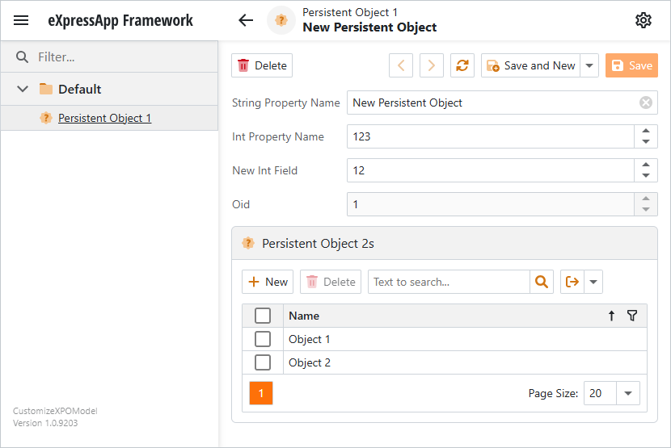

<!-- default badges list -->

[](https://supportcenter.devexpress.com/ticket/details/E250)
[](https://docs.devexpress.com/GeneralInformation/403183)
[](#does-this-example-address-your-development-requirementsobjectives)
<!-- default badges end -->

# XAF - Customize an XPO Business Model at Runtime

You can extend existing business classes without modifying their source code. For instance, this approach is helpful when you work with an assembly that contains persistent classes.

This example modifies business classes declared in a separate project as follows:
- Adds an attribute ([DefaultClassOptionsAttribute](https://docs.devexpress.com/eXpressAppFramework/DevExpress.Persistent.Base.DefaultClassOptionsAttribute))
- Creates a new simple persistent property (`NewIntField`)
- Creates new reference and collection properties linked by an association (one-to-many relationship between `PersistentObject1` and `PersistentObject2` classes)



## Implementation Details

1. Populate the [AdditionalExportedTypes](https://docs.devexpress.com/eXpressAppFramework/DevExpress.ExpressApp.ModuleBase.AdditionalExportedTypes) property with types from external storage to add them to the application.
    ```cs
    this.AdditionalExportedTypes.Add(typeof(MyXPOClassLibrary.PersistentObject1));
    this.AdditionalExportedTypes.Add(typeof(MyXPOClassLibrary.PersistentObject2));
    ```

2. Modify the added types as follows:

    * Call the [AddAttribute](https://docs.devexpress.com/eXpressAppFramework/DevExpress.ExpressApp.DC.IBaseInfo.AddAttribute(System.Attribute)) method to add an attribute to an existing class.  
        Note that by design you cannot dynamically add or remove the `OptimisticLocking` or `DeferredDeletion` attribute.
        ```cs
        ITypeInfo typeInfo1 = typesInfo.FindTypeInfo(typeof(PersistentObject1));
        typeInfo1.AddAttribute(new DevExpress.Persistent.Base.DefaultClassOptionsAttribute());
        ```
    * Call the [CreateMember](https://docs.devexpress.com/eXpressAppFramework/DevExpress.ExpressApp.DC.ITypeInfo.CreateMember(System.String-System.Type)) method to create a new simple persistent property.  
        ```cs
        IMemberInfo memberInfo0 = typeInfo1.FindMember("NewIntField");
        if (memberInfo0 == null) {
            typeInfo1.CreateMember("NewIntField", typeof(int));
        }
        ```
    * Use both [AddAttribute](https://docs.devexpress.com/eXpressAppFramework/DevExpress.ExpressApp.DC.IBaseInfo.AddAttribute(System.Attribute)) and [CreateMember](https://docs.devexpress.com/eXpressAppFramework/DevExpress.ExpressApp.DC.ITypeInfo.CreateMember(System.String-System.Type)) methods to create new reference and collection properties linked by an association.
        ```cs
        ITypeInfo typeInfo2 = typesInfo.FindTypeInfo(typeof(PersistentObject2));
        IMemberInfo memberInfo1 = typeInfo1.FindMember("PersistentObject2s");
        IMemberInfo memberInfo2 = typeInfo2.FindMember("PersistentObject1");
        if (memberInfo1 == null) {
            memberInfo1 = typeInfo1.CreateMember("PersistentObject2s", typeof(DevExpress.Xpo.XPCollection<PersistentObject2>));
            memberInfo1.AddAttribute(new DevExpress.Xpo.AssociationAttribute("PersistentObject1-PersistentObject2s", typeof(PersistentObject2)), true);
            memberInfo1.AddAttribute(new DevExpress.Xpo.AggregatedAttribute(), true);
        }
        if (memberInfo2 == null) {
            memberInfo2 = typeInfo2.CreateMember("PersistentObject1", typeof(PersistentObject1));
            memberInfo2.AddAttribute(new DevExpress.Xpo.AssociationAttribute("PersistentObject1-PersistentObject2s", typeof(PersistentObject1)), true);
        }
        ```
3. Call the [RefreshInfo(Type)](https://docs.devexpress.com/eXpressAppFramework/DevExpress.ExpressApp.DC.ITypesInfo.RefreshInfo(System.Type)) method to refresh metadata for the modified types.
    ```cs
    typesInfo.RefreshInfo(typeof(PersistentObject1));
    typesInfo.RefreshInfo(typeof(PersistentObject2));
    ```

## Files to Review

* [PersistentObject1.cs](CS/CustomizeXPOModel/MyXPOClassLibrary/PersistentObject1.cs)
* [PersistentObject2.cs](CS/CustomizeXPOModel/MyXPOClassLibrary/PersistentObject2.cs)
* [Module.cs](CS/CustomizeXPOModel/CustomizeXPOModel.Module/Module.cs) 

## Documentation 

* [Ways to Add a Business Class](https://docs.devexpress.com/eXpressAppFramework/112847/business-model-design-orm/ways-to-add-a-business-class#add-classes-from-a-business-class-library-or-module)
* [Use Metadata to Customize Business Classes Dynamically](https://docs.devexpress.com/eXpressAppFramework/113583/business-model-design-orm/types-info-subsystem/use-metadata-to-customize-business-classes-dynamically)
* [Access Business Object Metadata](https://docs.devexpress.com/eXpressAppFramework/113224/business-model-design-orm/types-info-subsystem/access-business-object-metadata)
* [How to create business classes at runtime based on predefined configurations or allow user to define custom members via the application UI](https://www.devexpress.com/Support/Center/p/T284822)
* [How to define a custom member for a domain component (DC) at runtime?](https://www.devexpress.com/Support/Center/p/S34769)

<!-- feedback -->
## Does this example address your development requirements/objectives?

[](https://www.devexpress.com/support/examples/survey.xml?utm_source=github&utm_campaign=XAF_how-to-customize-an-xpo-business-model-at-runtime-example-e250&~~~was_helpful=yes) [](https://www.devexpress.com/support/examples/survey.xml?utm_source=github&utm_campaign=XAF_how-to-customize-an-xpo-business-model-at-runtime-example-e250&~~~was_helpful=no)

(you will be redirected to DevExpress.com to submit your response)
<!-- feedback end -->
